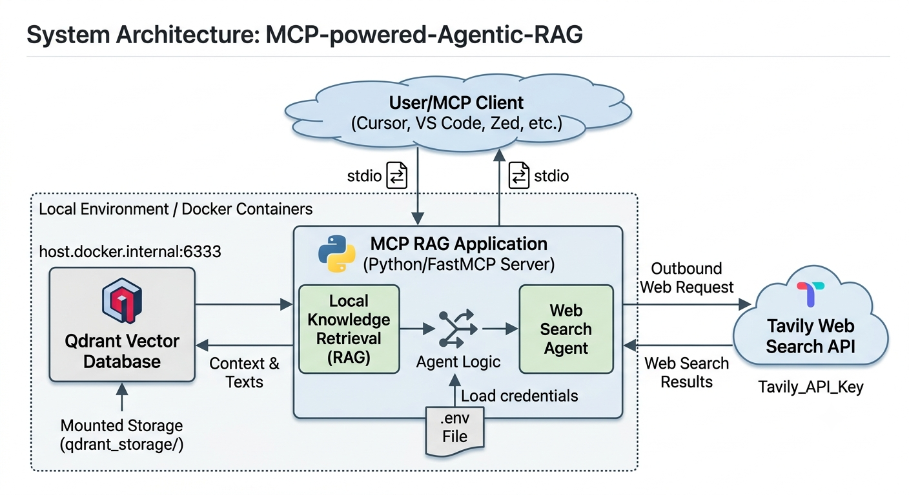

# MCP-powered-Agentic-RAG

An intelligent, Agentic Retrieval-Augmented Generation (RAG) system utilizing the **Model Context Protocol (MCP)**. This application exposes a local vector database and a web-search fallback engine as standard MCP tools, allowing compliant AI editors (like Cursor, Claude Desktop, or VS Code with Cline) to autonomously orchestrate intelligent document retrieval and live web discovery.

## 🚀 Architecture Overview

The system bridges an MCP Client with underlying backend engines using standard I/O (stdio) communication:

1. **Local Vector Database (RAG)**: Communicates with a **Qdrant** Docker container running locally to find highly relevant machine learning context parsed via semantic vector matching.
2. **Web Search Agent**: Automatically switches to the **Tavily API** fallback mechanism when the user's intent branches outside of the local specialized machine learning knowledge base.


---

## 🛠 Features

- **Model Context Protocol (FastMCP)** Compliance for seamless plug-and-play tool discovery.
- **Dual-Tool Ecosystem**:
  - `machine_learning_faq_retrieval_tool`: Machine Learning vector semantic context retrieval via local database.
  - `tavily_web_search_tool`: Automated advanced deep web search fallback engine.
- **Production-Ready Multi-Stage Dockerfile** minimizing final runtime layers for secure and compact image distributions.

---

## ⚙️ Prerequisites

Before getting started, make sure you have the following installed on your local host:
- Python 3.11+
- Docker & Docker Desktop (for container management)
- A Tavily Search API Key

---

## 📂 Quick Start Configuration

### 1. Environment Variables Setup
Create a `.env` file in the root directory of your project:

```env
TAVILY_API_KEY=your_tavily_api_key_here
```

### 2. Run the Qdrant Container

Spin up your local Qdrant Vector database locally on port 6333:
```bash
docker run -d -p 6333:6333 -p 6334:6334 -v $(pwd)/qdrant_storage:/qdrant/storage qdrant/qdrant
```

### 3. Local Virtual Environment Setup

If running natively without Docker inside your client IDE:
```bash
# Create the environment
python -m venv .venv

# Activate the environment (Windows)
.\.venv\Scripts\activate

# Install dependencies
pip install -r requirements.txt
```

## 🔌 Connecting to MCP Clients

### a. Connecting to Cursor IDE

To plug this server directly into Cursor's agentic framework, open Cursor's settings (Ctrl + , or Cmd + ,), navigate to Features -> MCP, click + Add New MCP Server, and populate it using forward slashes (/) for Windows path compatibility:

- Name: `mcp-rag-app`

- Type: `command`

- Command: `C:/path-to-dir/MCP-powered-Agentic-RAG/.venv/Scripts/python.exe`

- Args: `C:/path-to-project-dir/MCP-powered-Agentic-RAG/server.py`

### b. Connecting to Claude Desktop

Add the following snippet inside your Claude App configuration profile (%APPDATA%\Claude\claude_desktop_config.json):
```json
{
  "mcpServers": {
    "mcp-rag-app": {
      "command": "C:/path-to-project-dir/MCP-powered-Agentic-RAG/.venv/Scripts/python.exe",
      "args": [
        "C:/path-to-project-dir/MCP-powered-Agentic-RAG/server.py"
      ]
    }
  }
}
```

## 🐳 Containerization (Docker Architecture)

This project features a multi-stage Dockerfile setup designed to separate building environments from clean lightweight execution runtimes to cut unnecessary compiler sizing.
##### Build Image Locally

```Bash
docker build -t mcp-rag-server .
```

##### Run Server Container

When deploying inside isolated Docker containers, map your local database endpoint inside python logic appropriately to `host.docker.internal:6333` to reach out to the host machine cleanly:
```Bash
docker run -d --name mcp-rag-container -p 8000:8000 --env-file .env mcp-rag-server
```